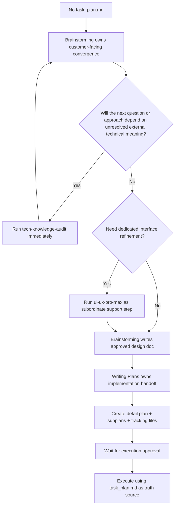

# Plan-For-All Workflow Diagram

## Overview

```text
Customer-Facing Convergence -> Implementation Handoff -> Execution Against Verified Steps
```

The workflow exists to keep long-running work grounded in explicit contracts, explicit verification, a single status source, fallback hook guardrails for session recovery, and a full-lifecycle audit mechanism for risky external knowledge.

---

## Phase Flow



---

## Ownership Model

| Stage / Skill | Primary Responsibility |
|---------------|------------------------|
| `brainstorming` | Customer-facing requirement convergence, scope clarification, design approval, final design doc |
| `ui-ux-pro-max` | Subordinate interface-refinement support after requirements are already converged |
| `writing-plans` | Implementation handoff for code-writing agents or developers |
| execution | Follow verified subplans, keep status honest, and react to new evidence |

---

## Artifact Roles

| File | Role | Owns Status? |
|------|------|--------------|
| `docs/plan-for-all/task_plan.md` | Canonical plan and status tracker | Yes |
| `docs/plan-for-all/findings.md` | Decisions, assumptions, risks, audit results | No |
| `docs/plan-for-all/progress.md` | Append-only factual log | No |
| `docs/plan-for-all/specs/*.md` | Approved design contracts | No |
| `docs/plan-for-all/plans/*.md` | Implementation plans | No |
| `docs/plan-for-all/plans/step_subplans/*.md` | Execution views | No |

---

## Brainstorming Output

The brainstorming phase is complete only when the design doc includes:
- problem statement
- goals
- non-goals
- constraints
- major capabilities or workflows
- acceptance criteria
- risks and open questions

Without these, planning is premature.

Before the next brainstorming question or approach comparison may depend on a public technical term or claim, that item must be audited first rather than pushed onto the user as a guess-driven choice.

If interface-specific refinement is needed, `ui-ux-pro-max` may refine the interface surface area, but `brainstorming` still owns the final design doc and the customer-facing convergence flow.

---

## Planning Output

Before the detail plan may proceed, mandatory terminology and external-knowledge audit items must be either verified or surfaced as blockers.

The same audit register stays active later: if decomposition or execution reveals a new risky term or changed external behavior, the item must be registered, rechecked, and reflected back into blockers rather than handled ad hoc.

A healthy detail plan contains:
- contract summary
- phases with objectives
- smoke checks or reproductions
- ordered actions
- verification commands
- exit criteria

A healthy subplan contains:
- current objective
- files in scope
- baseline check
- execution steps
- knowledge blockers or recheck-required items when relevant
- exit criteria

---

## Execution Rules

Execution begins from `task_plan.md`, not from memory.

Hooks stay enabled as fallback guardrails:
- `UserPromptSubmit` reminds the agent to restore context from the planning files
- `PreToolUse` replays current status and active execution context
- `PostToolUse` reminds the agent to sync plan state and run TDD/verification after mutations
- `Stop` reminds the agent to leave truthful status on disk

For each active step:
1. read the active subplan
2. run the baseline check
3. follow the step sequence
4. run verification
5. update `task_plan.md`
6. append a factual log entry to `progress.md`

---

## Anti-Patterns Removed From The Legacy Flow

The remediated system rejects:
- workflow-summary metadata
- pretending hooks alone can replace the written workflow contract
- subplans as raw copies of detail plans
- status claims in multiple files
- implementation-heavy plans with weak verification
- treating `ui-ux-pro-max` as a peer owner of requirement convergence
